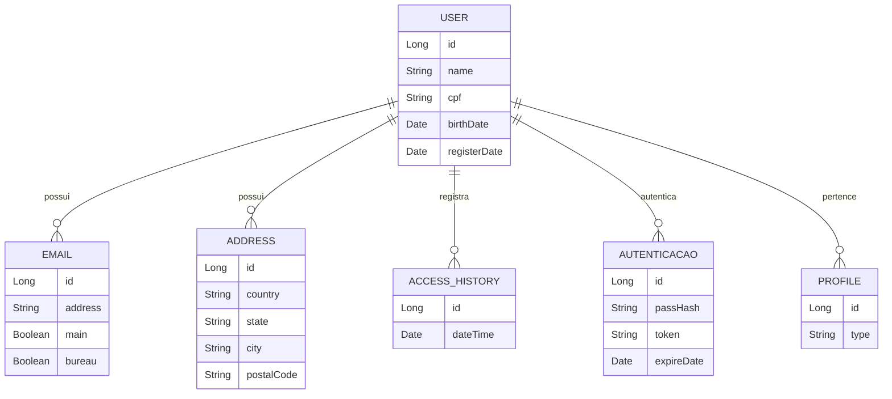

# API de Agendamento de Reservas

Este projeto é uma API RESTful desenvolvida em Spring Boot 3.4.3 e Java 17, projetada para gerenciar reservas em um sistema de agendamento. A API está hospedada no Railway e utiliza um banco de dados PostgreSQL para persistência de dados. A documentação da API é gerada automaticamente pelo SpringDoc OpenAPI (Swagger).

# 🛠 Tecnologias Utilizadas
Spring Boot 3.4.3

Java 17

PostgreSQL (Banco de dados)

Spring Data JPA (Persistência de dados)

SpringDoc OpenAPI (Documentação da API)

Railway (Hospedagem e deploy)

## 📊 Diagrama de Entidades
Abaixo está o diagrama de entidades do projeto, que ilustra as tabelas do banco de dados e seus relacionamentos:

